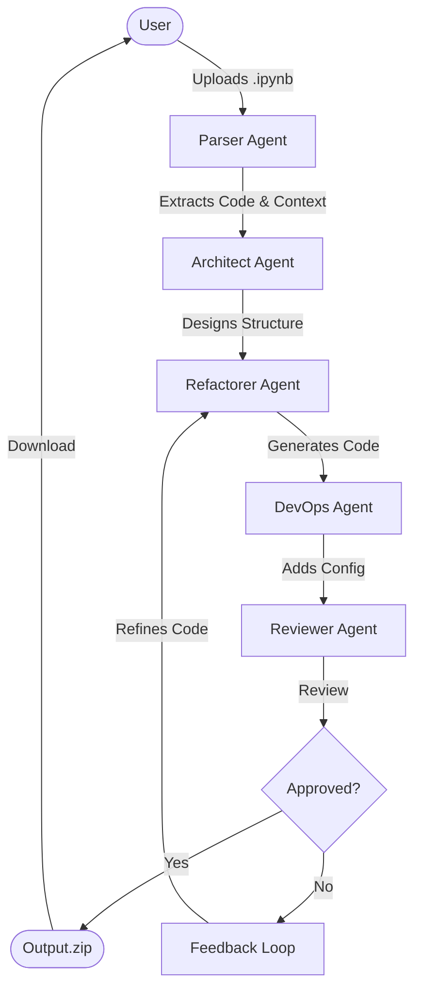

# 🤖 Notebook to Code Agent

A powerful multi-agent system that converts experimental Jupyter Notebooks into production-ready, modular Python codebases.

## 🌟 Features

-   **Multi-Agent Architecture**: Uses specialized agents (Parser, Architect, Refactorer, DevOps, Reviewer) to handle different aspects of the conversion.
-   **Conversational UI**: Chat-based interface built with Streamlit to guide you through the process.
-   **Automated Refactoring**: Converts flat notebooks into structured projects (`data_loader.py`, `model.py`, `train.py`, etc.).
-   **Quality Assurance**: Includes a Reviewer Agent that checks for logic errors, efficiency, and style before approval.
-   **DevOps Ready**: Automatically generates `Dockerfile` and `requirements.txt`.
-   **Secure**: Built-in PII (Personally Identifiable Information) detection.

## 🏗️ Architecture

The pipeline consists of the following agents powered by **Google Gemini 2.0 Flash**:

1.  **Parser Agent**: Reads the raw `.ipynb` file and extracts code and markdown context.
2.  **Architect Agent**: Analyzes the content and designs a modular project structure.
3.  **Refactorer Agent**: Writes the actual Python code for each module based on the plan.
4.  **DevOps Agent**: Creates deployment configurations (Docker, CI/CD).
5.  **Reviewer Agent**: Critiques the generated code. If issues are found, the Refactorer fixes them in a feedback loop.

### 📊 Workflow Diagram



## 🚀 Getting Started

### Prerequisites

-   Python 3.10+
-   Google API Key (for Gemini 2.0 Flash)

### Installation

1.  Clone the repository:
    ```bash
    git clone <your-repo-url>
    cd notebook-to-code-agent
    ```

2.  Install dependencies:
    ```bash
    pip install -r requirements.txt
    # OR using uv
    uv pip install -r requirements.txt
    ```

3.  Set up environment variables:
    Create a `.env` file:
    ```env
    GOOGLE_API_KEY=your_api_key_here
    ```

### Usage

Run the Streamlit application:

```bash
streamlit run app.py
```

1.  Open the app in your browser (usually `http://localhost:8501`).
2.  Enter your Google API Key (if not set in `.env`).
3.  Upload your Jupyter Notebook (`.ipynb`).
4.  Watch the agents collaborate in the chat window.
5.  Download the final `generated_code.zip` when complete.

## 📂 Project Structure

```
.
├── agents/                 # Agent definitions
│   ├── parser_agent.py
│   ├── architect_agent.py
│   ├── refactorer_agent.py
│   ├── devops_agent.py
│   └── reviewer_agent.py
├── src/                    # Core logic and tools
├── tests/                  # Unit tests
├── app.py                  # Streamlit Chat Interface
├── main.py                 # CLI Entry point
├── requirements.txt        # Project dependencies
└── README.md               # This file
```

## 🛠️ Development

To run tests:

```bash
uv run pytest tests/
```

## 📄 License

MIT
